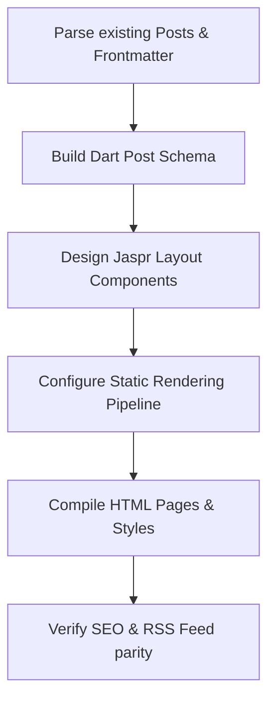

# Migration Strategy: Jekyll to Dart & Jaspr

This document outlines the migration plan for **kevmoo @ Work** (work.j832.com) from a Ruby-based Jekyll setup to a modern Dart-based **Jaspr** web application.

---

## 🎯 Primary Migration Goals

* **Strict URL Preservation (Non-Negotiable):** Maintain every single existing post and page URL perfectly (matching the permalink structure `/:year/:month/:title.html` and pages like `/about/`) to ensure absolutely zero broken incoming links or SEO regression.
* **High Content Fidelity & Source Minimal Diff Goal:**
  * Preserve at least 95% of the current blog post content.
  * **Minimal Post File Changes:** The actual files in `_posts/` must remain virtually unchanged. The custom Dart parser tool must be smart enough to consume the current Jekyll YAML frontmatter and markdown/HTML formats directly without requiring a manual refactoring pass of the 126 post source files. Keeping the git diff of the source post files minimal is a key priority.
* **Acceptance Criteria / Flexibility:**
  * **Markup Compilation Tolerance:** We are completely flexible if the generated HTML tags around markdown elements shift slightly compared to the old Kramdown output.
  * **Visual Layout:** We are completely flexible on changing the visual look, aesthetics, and CSS/Tailwind design. A fresh, modern layout is highly welcome!
  * **RSS Feed Output:** Slight shifts or modifications in the parsed XML RSS output are perfectly acceptable, as long as the feed format itself is valid and active.

---

## 🎯 Architectural Goals & Choices

### 1. Static Site Generation (SSG) vs. SSR / Client SPA
* **Recommendation:** **Static Site Generation (SSG)**.
* **Rationale:** 
  * The site is currently a fast, static blog hosted on Firebase Hosting.
  * There are **126 posts** dating back to 2007, mostly containing static markdown/HTML with some code snippet highlighting.
  * SSG ensures **sub-millisecond load times**, **perfect SEO out-of-the-box**, **no server-side running costs**, and **zero scaling issues**.
  * We can still compile client-side Dart/JS/Wasm if we want to introduce minor interactive features later (like dynamic search or interactive code runner tools).

### 2. Preserving SEO and URL Permalinks
* **Requirement:** The Jekyll site uses:
  ```yaml
  permalink: /:year/:month/:title.html
  ```
* **Strategy:** 
  * Our Jaspr router or static compiler must generate pages matching this exact pattern.
  * When generating the static build output:
    * For each post, compile the output to a file path like `build/2012/07/qr-code-generation-in-dart.html` (using a raw `.html` extension) OR set up Firebase Hosting redirects/rewrites if using clean URLs.
    * Maintaining the exact same file structures is the safest path to keep existing links, search rankings, and Google Analytics working without breaking.

---

## 📦 Jaspr Ecosystem Brainstorming

Our research of the pub.dev registry has revealed several high-quality options specifically developed for Jaspr and blogging/content workflows:

1. **`jaspr` (Core)**: The underlying reactive web framework.
2. **`jaspr_content`** (by Kilian Schulte, creator of Jaspr):
   * An official-feeling package designed specifically for content-driven sites.
   * Supports rich custom components (Callouts, Sidebar, Code Blocks, Header, Tabs, Theme Toggle).
   * Very well-suited for documentation or structured blogs.
3. **`jaspr_markdown`**:
   * A Markdown renderer that allows embedding Jaspr components inside Markdown (similar to MDX in React/Next.js).
   * Highly useful for interactive posts that require complex charts or custom Dart components inline.
4. **`jaspr_tailwind` & `shadcn_jaspr`**:
   * For introducing modern styling pipelines if we want to move away from standard Sass/CSS stylesheets.

### Recommended Tech Stack:
* **Core UI & SSG Rendering:** `package:jaspr`
* **Content & Markdown Parsing:** `package:jaspr_markdown` or custom markdown rendering with `package:markdown` and YAML frontmatter parsing (via `package:yaml`).
* **Styling:** Custom styling matching the existing visual layout, or migrating to Tailwind using `package:jaspr_tailwind`.

---

## 🔍 Analyzing the Existing Site Layout

### Source Layouts & Includes
* **`_layouts/default.html`**: Wraps everything in standard `<!DOCTYPE html>`, ``, ``, and `` templates.
* **`_layouts/post.html`**: Formats a single blog post with a header containing the title, publishing date, and the article body with `itemscope` schemas.
* **`_sass/` and `css/`**: A few base layout and syntax highlighting stylesheets.
* **`scripts/js.js`**: A lightweight client-side script that loads Google Code Prettify to format `<pre><code>` tags.

### Posts Data (The raw material)
* **126 posts** total.
* A mix of `.html` and `.md` formats.
* All posts start with YAML frontmatter specifying the layout, title, and date.
  * Example:
    ```yaml
    ---
    layout: post
    title: "QR Code Generation in Dart"
    date: 2012-07-20 12:00:00
    ---
    ```

---

## 🚀 Step-by-Step Migration Plan



### Phase 1: The Content Loader (Dart CLI tool)
Before compiling the website, we need a Dart utility that runs at build time to:
1. Read all files in `_posts/`.
2. Parse YAML frontmatter (Title, Date, Layout, Tags) using `package:yaml`.
3. Convert Markdown content to HTML (or parse it into structured Jaspr component trees).
4. Sort posts chronologically and group them by tag/date.

### Phase 2: Component Development (Jaspr)
We replicate the existing HTML structure in component-based Dart:
* `ShellComponent`: Layout page container replacing `_layouts/default.html`.
* `HeaderComponent` & `FooterComponent`: Replacing `_includes/header.html` and `footer.html`.
* `PostComponent`: Replaces `_layouts/post.html` and accepts a parsed Markdown article body.
* `PostListComponent`: Replaces the list logic in `index.html`.

### Phase 3: Tailwind Styling and Asset Synchronization
* Configure `package:jaspr_tailwind` to track styling utilities directly from our Dart layout components.
* Set up tailwind configurations (fonts, primary palette, dark mode triggers).
* Synchronize and retain legacy assets and images in the `/assets` directory.

### Phase 4: Static Page Pre-rendering
* Set up Jaspr's pre-rendering targets in `pubspec.yaml`.
* Run `jaspr build` to export the static files.
* Update `firebase.json` to point to the new Jaspr build directory (usually `build/web/`).

---

## 💬 Grilling Sessions: Design & Architecture Questions

Through our collaborative grilling session, we have resolved the key design branches:

### 1. Styling Pipeline
* **Decision:** **Tailwind CSS (via `package:jaspr_tailwind`)**
* **Details:** Replace the legacy Jekyll SASS files with Tailwind CSS. This eliminates the SASS compilation overhead, allows component-localized styles directly in Dart files, and makes introducing modern, responsive layouts, custom fonts, and Dark Mode trivial.

### 2. Content Parsing
* **Decision:** **Build-Time Static Compilation**
* **Details:** Build a custom Dart CLI builder tool that parses YAML frontmatter and Markdown at compile time. This guarantees a super clean static output with zero JavaScript overhead, preserving sub-millisecond load speeds.

### 3. Prerendering & Route Integration
* **Decision:** **Jaspr Native Prerendering Route Injection**
* **Details:** Read the post files database at compile time, injecting them dynamically into Jaspr's prerendering route list. When `jaspr build` runs, it will systematically prerender all 126 static HTML pages.

### 4. Syntax Highlighting
* **Decision:** **Build-Time Static Highlighting**
* **Details:** Replace the client-side CDN Google Code Prettify scripts with a pure Dart highlighting package at compile time, baking the highlighted elements directly into the HTML.

### 5. RSS Feed and Sitemap
* **Decision:** **Auto-Generated XML Assets**
* **Details:** Programmatically generate both `/feed.xml` and `/sitemap.xml` during the compile pipeline, ensuring a zero-loss transition for SEO and existing RSS subscribers.
